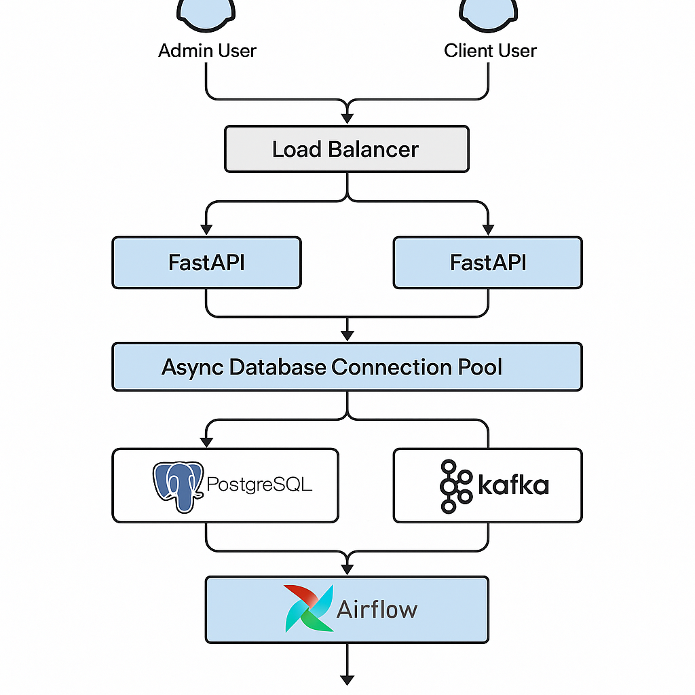

# Scaling, Parallel Users & Data Handling

This documentation provides insights on how the system is designed to handle **parallel users**, **load balancing**, **database connection pooling**, and **scalable data processing**. It also covers **data normalization**, **missing value handling**, and **outlier management**.  

---

## 1. Parallel Users & Database Scaling

The system is designed to support multiple users accessing the same database simultaneously. By using **async database connections** and **connection pooling**, the application can efficiently manage parallel requests while avoiding bottlenecks.

### Database Connection Example

```python
@staticmethod
async def connection():
    """
    Establishes a connection to the PostgreSQL database using asyncpg.
    Ensures the database exists, creating it if necessary.
    """
    try:
        # Connect to Postgres without specifying a database first
        initial_connection = await asyncpg.connect(
            host=logger_settings.AUTH_DB_HOST,
            user=logger_settings.AUTH_DB_USER,
            password=logger_settings.AUTH_DB_PASSWORD,
            port=int(logger_settings.AUTH_DB_PORT),
            database='postgres'  # default database
        )

        db_name = logger_settings.AUTH_DB
        db_exists = await initial_connection.fetchval(
            "SELECT 1 FROM pg_database WHERE datname=$1", db_name
        )
        if not db_exists:
            await initial_connection.execute(f'CREATE DATABASE "{db_name}"')
            print(f"Database '{db_name}' created successfully.")

        await initial_connection.close()

        # Reconnect to the specified database
        connection = await asyncpg.connect(
            host=logger_settings.AUTH_DB_HOST,
            user=logger_settings.AUTH_DB_USER,
            password=logger_settings.AUTH_DB_PASSWORD,
            database=db_name,
            port=int(logger_settings.AUTH_DB_PORT)
        )
        return connection

    except Exception as e:
        raise HTTPException(status_code=500, detail=f"Error connecting to the database: {e}")
```

### Connection Pooling

Using a connection pool ensures that multiple users can reuse database connections, reducing latency and improving throughput:

```python
_pool: Pool = None

@classmethod
async def get_pool(cls) -> Pool:
    if cls._pool is None:
        cls._pool = await asyncpg.create_pool(
            host=logger_settings.AUTH_DB_HOST,
            user=logger_settings.AUTH_DB_USER,
            password=logger_settings.AUTH_DB_PASSWORD,
            database=logger_settings.AUTH_DB,
            port=logger_settings.AUTH_DB_PORT,
            min_size=1,
            max_size=10
        )
    return cls._pool
```

**Benefits:**
- Supports multiple concurrent connections.
- Reduces overhead of creating/destroying connections repeatedly.
- Ensures dashboard scalability for both admin and client users with proper permissions.

⸻

## 2. Load Balancing

The backend can be deployed behind a load balancer, which distributes requests among multiple instances. This allows:
- Horizontal scaling of FastAPI application servers.
- Parallel handling of user requests.
- High availability and fault tolerance.

⸻

## 3. Data Normalization & Cleaning

Proper data handling is crucial when scaling analytics. The following methods are used:

### Normalization

```python
import pandas as pd
from sklearn.preprocessing import MinMaxScaler

data = pd.DataFrame({'content_length': [1200, 800, 950, 1500]})
scaler = MinMaxScaler()
data['normalized_length'] = scaler.fit_transform(data[['content_length']])
```

### Handling Missing Values

```python
data['category'].fillna('Unknown', inplace=True)
```

### Handling Outliers

```python
import numpy as np

Q1 = data['content_length'].quantile(0.25)
Q3 = data['content_length'].quantile(0.75)
IQR = Q3 - Q1
data = data[~((data['content_length'] < Q1 - 1.5 * IQR) |
              (data['content_length'] > Q3 + 1.5 * IQR))]
```

⸻

## 4. Scaling for Large Schema & Data

For larger databases and massive datasets, additional technologies and patterns are employed:

### 4.1 Workflow Orchestration

Apache Airflow is used for scheduling ETL jobs and ensuring dependencies are handled efficiently.

```python
from airflow import DAG
from airflow.operators.python_operator import PythonOperator
from datetime import datetime

def process_data():
    print("Processing large dataset...")

dag = DAG('data_pipeline', start_date=datetime(2025, 1, 1), schedule_interval='@daily')
task = PythonOperator(task_id='process_data_task', python_callable=process_data, dag=dag)
```

### 4.2 Distributed Computing

Apache Spark enables parallel processing across large datasets:

```python
from pyspark.sql import SparkSession

spark = SparkSession.builder.appName("analytics").getOrCreate()
df = spark.read.csv("large_data.csv", header=True)
df.groupBy("category").count().show()
```

### 4.3 Real-time Streaming

Apache Kafka handles high-velocity streaming data, ensuring real-time analytics:

```python
from kafka import KafkaProducer

producer = KafkaProducer(bootstrap_servers='localhost:9092')
producer.send('engagement_topic', b'New engagement event')
producer.flush()
```

<p align="center">
  
</p>

⸻

## 5. Summary
- **Parallel Users:** Async connections + connection pooling allow multiple users to access the same database efficiently.
- **Load Balancing:** Ensures horizontal scaling and high availability of the dashboard.
- **Data Handling:** Normalization, missing value treatment, and outlier handling improve analytics quality.
- **Scalable Data Processing:** For larger datasets, Airflow, Spark, and Kafka provide robust ETL, batch, and streaming capabilities.
- **Admin & Client Access:** Both can securely use the same database without interference, with proper permission control.

