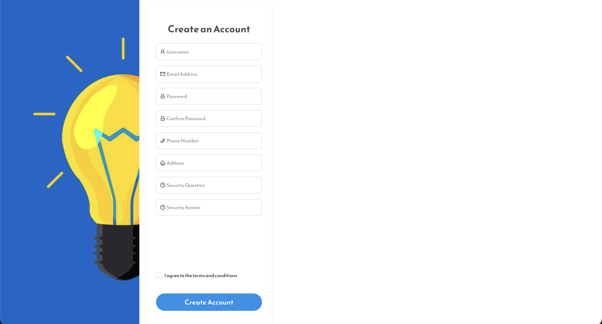
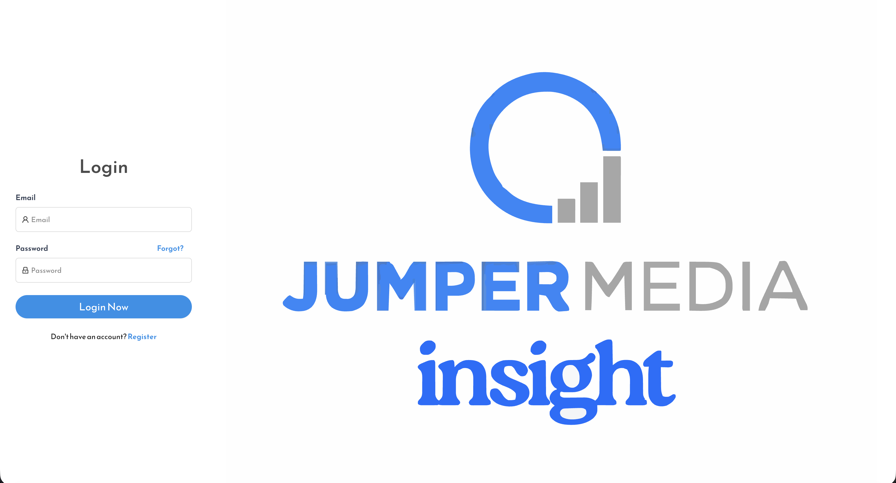
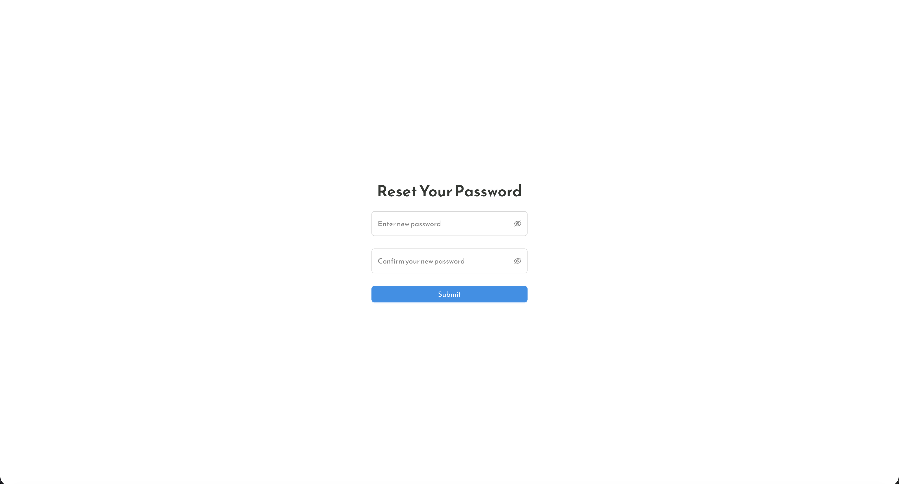
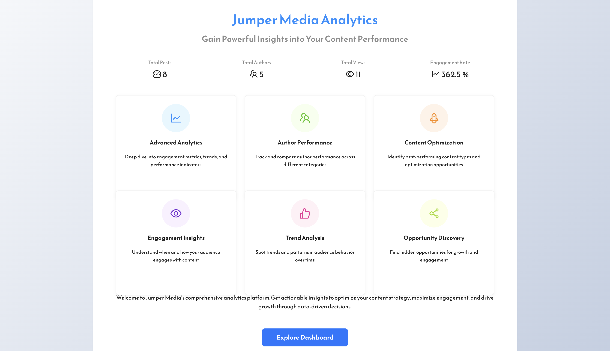
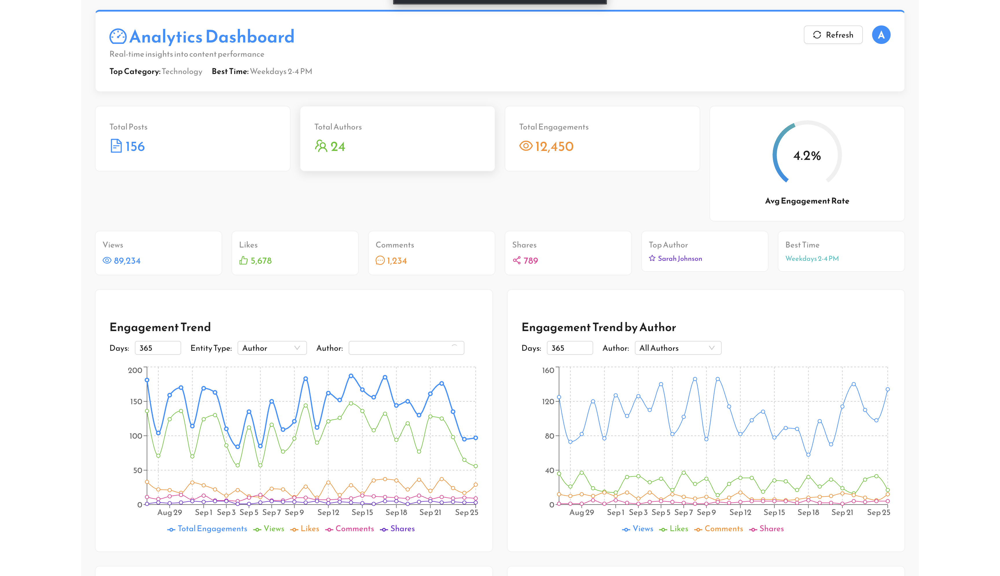
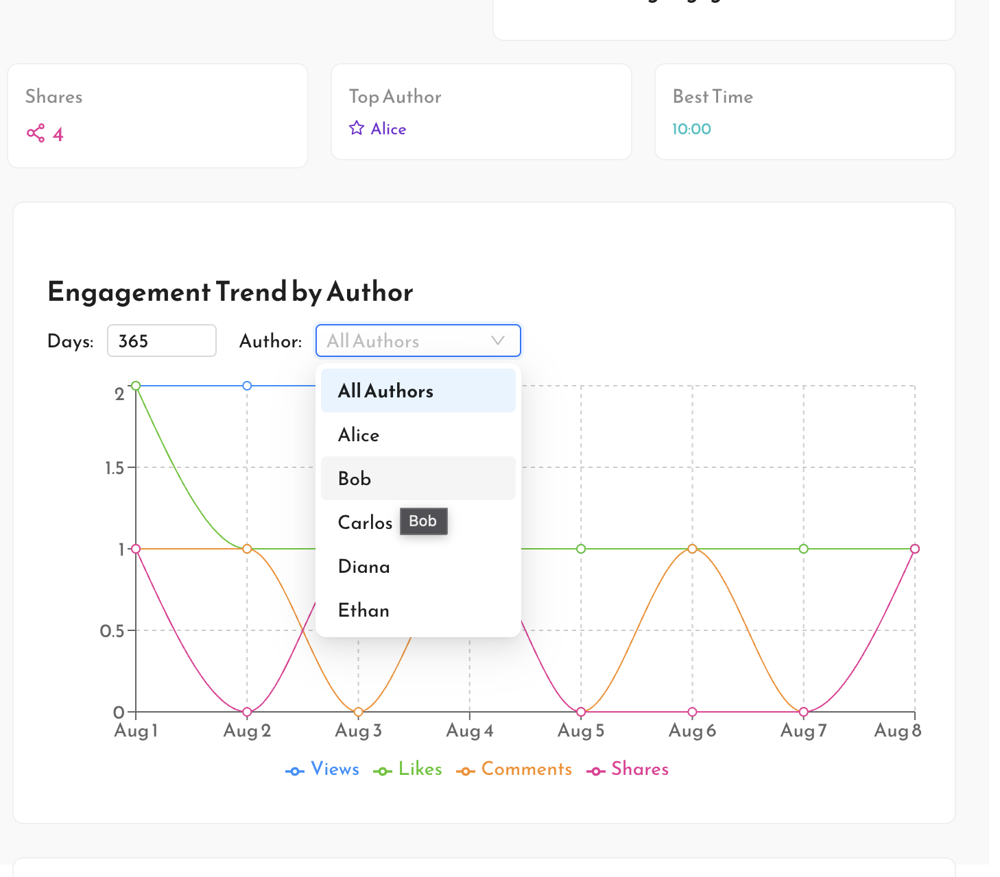
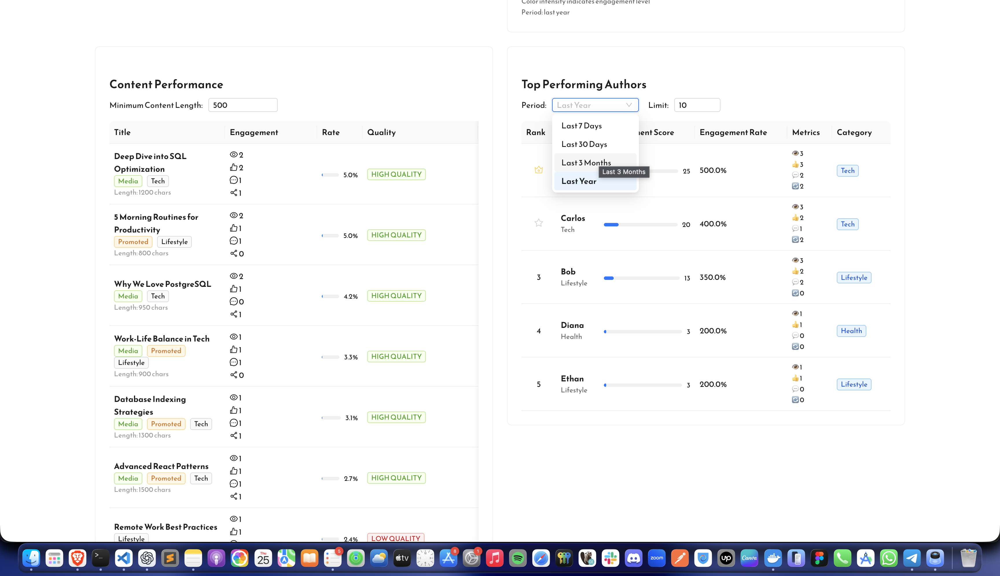
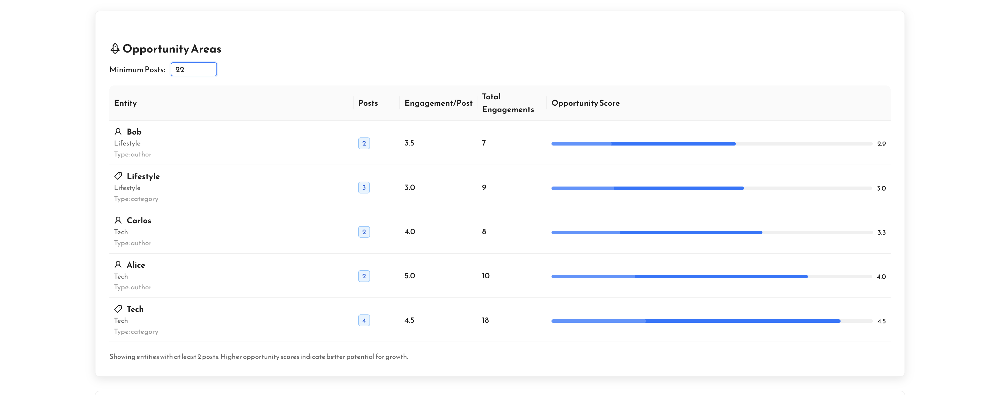
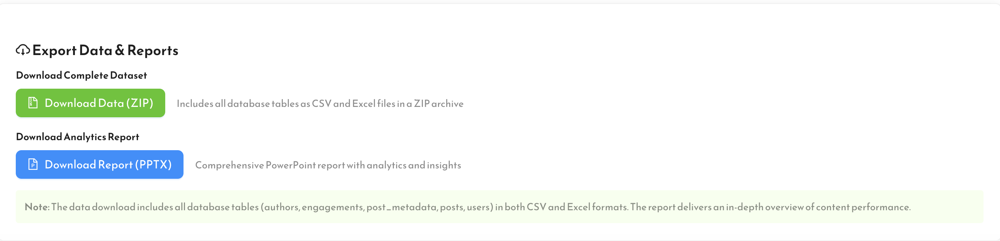

# Application User Guide

This guide walks through the main user flows and dashboard features of the application.

---

## Step 1: Register

**Description:**  
The first step for new users is registration. Users need to provide basic information such as username, email, and password. After successful registration, users are redirected to the login page.

---

## Step 2: Login

**Description:**  
Registered users log in using their email and password. If credentials are valid, the user is redirected to the welcome page.  

---

## Step 3: Forgot Password

**Description:**  
If a user forgets their password, they can click on "Forgot Password" to initiate the password recovery process. Users will receive an email with instructions to reset their password.  

---

## Step 4: Reset Password

**Description:**  
After receiving the password reset email, users are directed to the reset password page. Here, they can enter a new password and confirm it. Once the password is successfully reset, the user can log in using the new password.  

---

## Step 5: Welcome Page

**Description:**  
After logging in successfully, users are greeted with the welcome page. This page provides an overview of the application and guides users to the dashboard to explore data and analytics.  

---

## Step 6: Dashboard Overview

**Description:**  
The dashboard is the central hub where users can view key metrics, charts, and widgets. Each widget represents different types of data such as recent activity, engagement metrics, or trends.

---

## Step 7: Dashboard Widgets and Filters

**Description:**  
Each widget on the dashboard has interactive filters allowing users to customize the data view. For example:  

- **Date Range Filter:** View data for a specific period.  
- **Category Filter:** Filter charts by specific categories or segments.  
- **Metric Selector:** Switch between different performance metrics.  

Users should use these filters to analyze data effectively and gain insights based on their preferences.

---

## Step 8: Download Data & Reports

**Description:**  
At any point, users can download the entire dataset by clicking the `Download Data` button. Additionally, users can generate a detailed report document by clicking the `Download Report` button. These features allow users to save and share insights conveniently.  

---

## Notes and Tips

- Always save filter selections if needed for repeated analysis.  
- Hover over charts to see detailed data points.  
